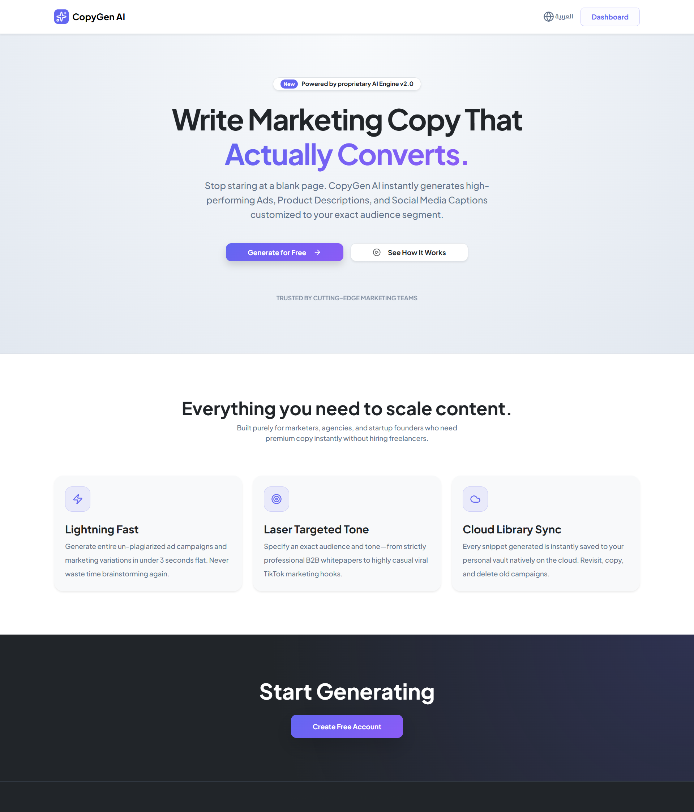
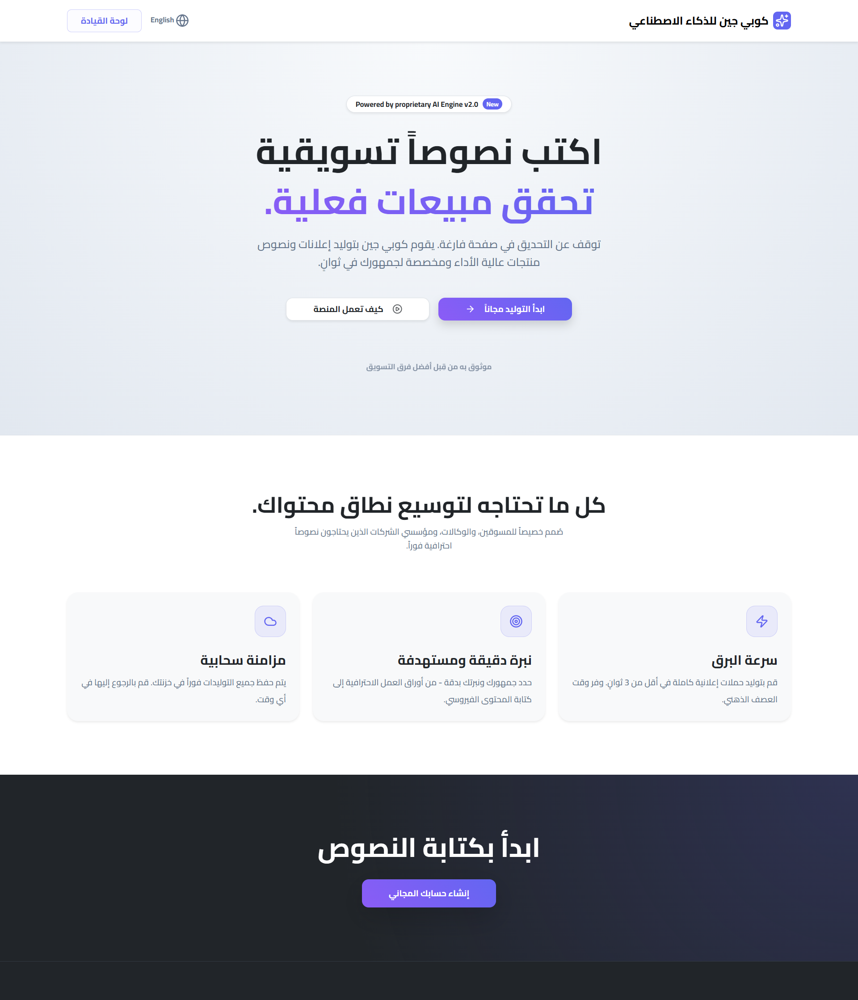
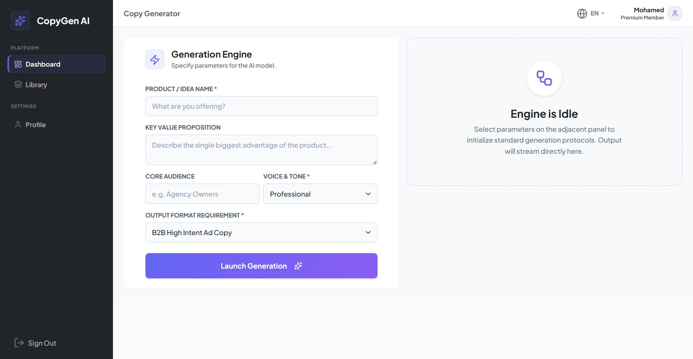
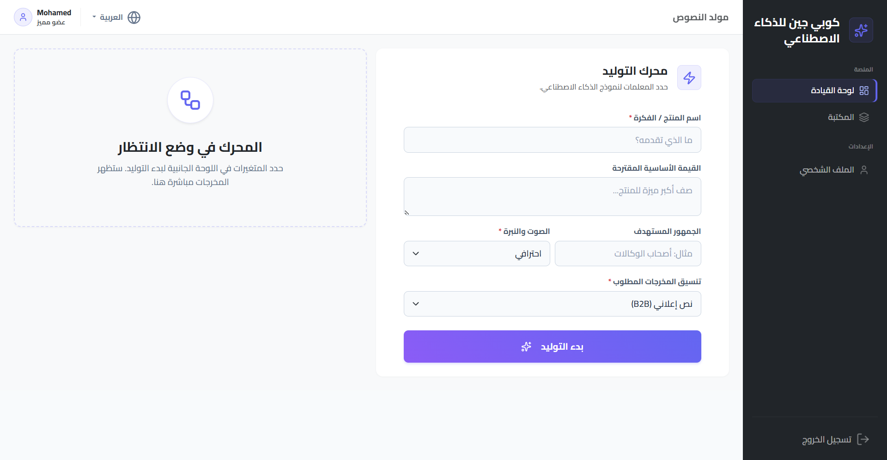
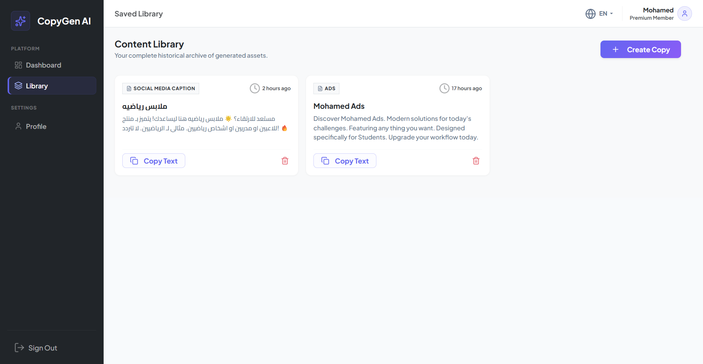
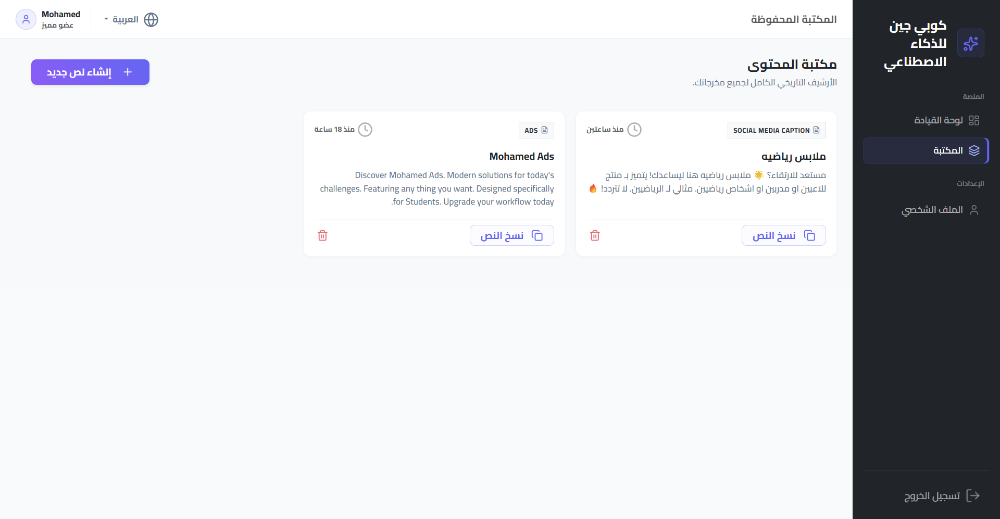
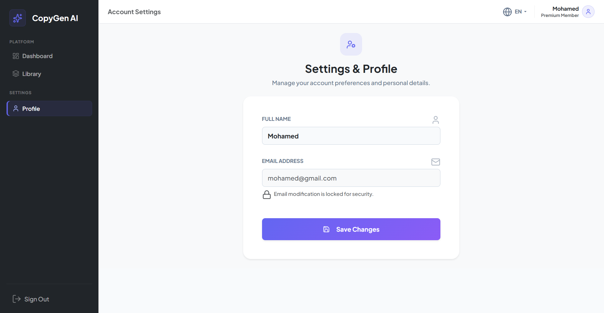
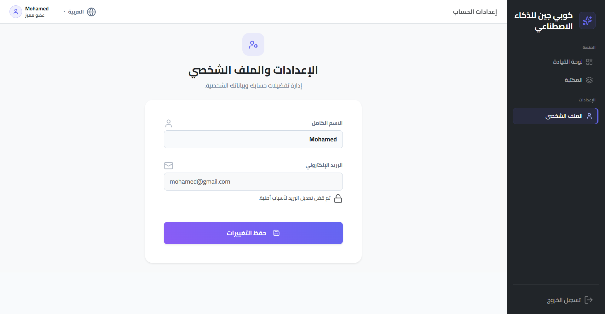

<div align="center">
  <h1>🚀 CopyGen AI</h1>
  <p>An enterprise-grade, localized AI copywriting platform designed to scale.</p>

  [](https://laravel.com)
  [](https://vitejs.dev/)
  [](https://hotwired.dev/)
</div>

<br />

## 📖 Overview
CopyGen is a high-performance **AI copywriting SaaS** built to generate tailored marketing copy, value propositions, and audience targeting materials. Engineered for enterprise flexibility, it features an ultra-fast Hotwired Turbo SPA architecture, premium UI styling, and deep out-of-the-box support for both **English (LTR)** and **Arabic (RTL)** right down to the typography and NLP generation layers.

---

## ✨ Core Features

- **🌐 Intelligent Localization & RTL**  
  Auto-switching between tailored English prompt architectures and entirely native Arabic NLP logic depending on the app's chosen locale. Mathematical PostCSS-driven Left-to-Right (LTR) and Right-to-Left (RTL) flipping guarantees UI integrity.
  
- **⚡ High-Velocity SPA Navigation**  
  Powered by `@hotwired/turbo` for instantaneous, invisible dashboard transitions without full page loads, delivering a desktop-like application feel.

- **📱 Flawless Mobile Experience**  
  A completely bulletproof mobile UI. The mobile navigation drawer uses zero-dependency vanilla JS and explicit viewport mathematics (`100dvh` and safe-area margins) to eliminate common iOS Safari scrolling bugs.

- **🔤 Typography Parity**  
  A master CSS Font Stack utilizing `'Plus Jakarta Sans'` and `'Cairo'` that flawlessly maintains mixed-language character boundaries without Javascript intervention.

---

## 🛠️ Tech Stack

### Backend
- **Framework:** Laravel 11 (PHP 8.2+)
- **Database:** MySQL / PostgreSQL
- **Architecture:** Hotwire Turbo integration for SPA routing

### Frontend
- **Styling Architecture:** SCSS, PostCSS RTLCSS (dynamic LTR/RTL compilation), CSS Variables
- **Icons:** Lucide Icons (lightweight JS wrapper)
- **Asset Pipeline:** Vite

---

## 📸 Screenshots

### 🏠 Landing Page
<div align="center">
  
  
  <p><i>Left: English (LTR) — Right: Arabic (RTL)</i></p>
</div>

### 🎛️ Dashboard / Generator
<div align="center">
  
  
  <p><i>The core AI generation playground adapting context automatically.</i></p>
</div>

### 📚 Library
<div align="center">
  
  
  <p><i>Saved generated outputs with seamless language support.</i></p>
</div>

### 👤 Profile
<div align="center">
  
  
  <p><i>User settings and preferences interface.</i></p>
</div>

---

## 🚀 Installation & Setup

1. **Clone the repository:**
   ```bash
   git clone https://github.com/mmohamedr/copygen-ai-saas.git
   cd copygen-ai-saas
   ```

2. **Install dependencies:**
   ```bash
   composer install
   npm install
   ```

3. **Build Frontend Assets:**
   ```bash
   npm run build
   ```

4. **Environment Setup:**
   ```bash
   cp .env.example .env
   php artisan key:generate
   ```
   *Note: Open `.env` and configure your database credentials and AI API paths.*

5. **Run Database Migrations:**
   ```bash
   php artisan migrate
   ```

6. **Start the Application:**
   ```bash
   php artisan serve
   ```
   *Your app will be available at `http://127.0.0.1:8000`.*

---
